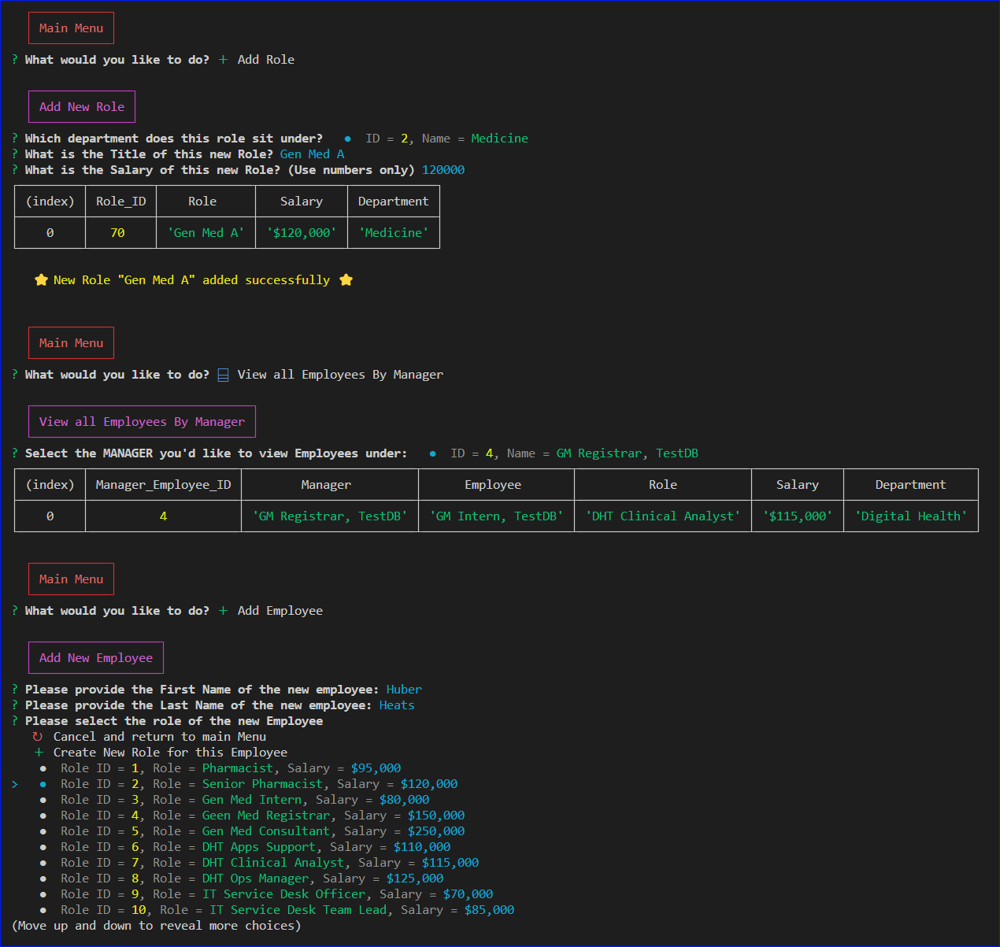
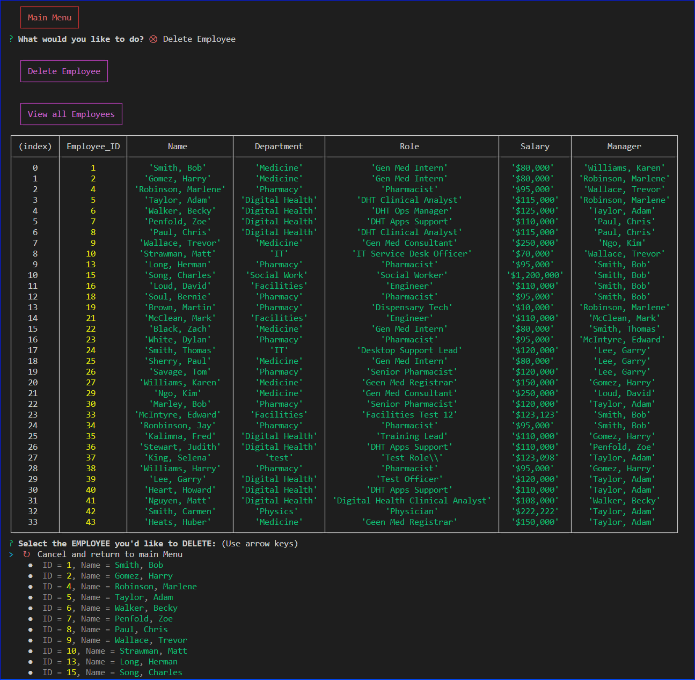

<a ID="readme-top"></a>

<div align="center">

# Huber's Employee Tracker

[](https://opensource.org/licenses/MIT)
[](https://nodejs.org/en)
[](https://www.npmjs.com/)


</div>


## Description

Employee Tracker is an employee management solution that keeps track of current employees, roles (job functions) and departments.
Employee Tracker is a command line interface (CLI) application that enables users to maintain the database. 

High level features of the solution are:
* Viewing the database - departments, roles and employees
* Additions to the database - departments, roles and employees
* Deleting from the database - departments, roles and employees
* Updates to employee records

This application has been developed from scratch

## Table of contents

- <a href="#user-story">User Story</a>
- <a href="#user-acceptance-criteria">User Acceptance Criteria</a>
- [Installation](#installation)
- [Usage](#usage)
- <a href="#video-screenshots">Video and Screenshots</a>
- [License](#license)
- [Contributing](#contributing)
- [Testing](#testing)
- <a href="#technologies-used">Technologies Used</a>
- [Questions](#questions)

## User Story <a ID="user-story"></a>

This application was developed with this user story in mind:

```
AS A business owner

I WANT to be able to view and manage the departments, roles, and employees in my company
SO THAT I can organize and plan my business
```

<p align="right">(<a href="#readme-top">back to top</a>)</p>

## User Acceptance Criteria <a ID="user-acceptance-criteria"></a>

### This application was developed with the below User acceptance criteria:

```
GIVEN a command-line application that accepts user input

WHEN I start the application
THEN I am presented with the following options: view all departments, view all roles, view all employees, add a department, add a role, add an 
employee, and update an employee role

WHEN I choose to view all departments
THEN I am presented with a formatted table showing department names and department ids

WHEN I choose to view all roles
THEN I am presented with the job title, role id, the department that role belongs to, and the salary for that role

WHEN I choose to view all employees
THEN I am presented with a formatted table showing employee data, including employee ids, first names, last names, job titles, departments, salaries, and managers that the employees report to

WHEN I choose to add a department
THEN I am prompted to enter the name of the department and that department is added to the database

WHEN I choose to add a role
THEN I am prompted to enter the name, salary, and department for the role and that role is added to the database

WHEN I choose to add an employee
THEN I am prompted to enter the employee’s first name, last name, role, and manager, and that employee is added to the database

WHEN I choose to update an employee role
THEN I am prompted to select an employee to update and their new role and this information is updated in the database 

```


### Additional requirements:

* MySQL2 package must be used to connect to MySQL database
* Inquirer package must be used to enable interaction via command line interface

#### Bonus features

The below optional features have been included in this application

* Ability to Update Employee Manager
* Ability to View Employees by Manager
* Ability to View Employees by Department
* Ability to Delete Departments
* Ability to Delete Roles
* Ability to Delete Employees
* Ability to View total Salary for a Department


#### Additional Featuures

Several personal challenges were set in the development of this application:
* Optimising the user interface for the CLI by utilising ANSI colours and icons to improve usability
* Features to improve workflow for the user:
    * When adding a new employee - the user has the option to add a new role and department as part of the process
    * Lists have the option of cancelling out of the process and returning to main menu
    * Formatted headings and confirmation messages to reduce cognitive buren on where/which task is being performed
    * When deleting records, the user is prompted again for confirmation
    * Formatting of Salaries to be prefixed with $ and have commas introduced
    * When viewing Department - two options are included:
        * Summary version (department level only)
        * Detailed version (department + associated roles and employees)

<p align="right">(<a href="#readme-top">back to top</a>)</p>

## Video and Screenshots <a ID = "video-screenshots"></a>

Screenshot of the application during "Add New Role" and "Add New Employee Process"\
* Note the headings rendered with colour schemes used
* Note formatting and use of icons and colours across the application

<div align="center">



</div>

Screenshot of the application during "Delete Employee" process
* Note the formatting of salary and icons and colours used in selection options

<div align="center">



</div>

<p align="right">(<a href="#readme-top">back to top</a>)</p>

## Installation

1. Clone or fork the repository
2. Run the below in concole install necessary packages
    * MySQL2 (Major version 3),
    * Inquirer (Major version 8),    
    * dotenv (Major version 8) 
```
npm i
```
3. After NPM packages have been installed, you'll need to set up your MySQL database for the application to read and write to. Log into MySQL2:
```
myself -u root -p
```
4. Within mysql2 - create the datbase with the schema provided, run the below command in the root folder (the below is the relative path):
```
source ./db/schema.sql
```
5. Optional - you can seed some data into the database while you are in mysql2 (Skip this step if you are going to use real data)
```
source ./db/seeds.sql
```
6. Exit MySQL2:
```
quit
```
7. You can run the application once packages have been installed and the database is created. Run the below in the CLI:
```
node index.js
```

<p align="right">(<a href="#readme-top">back to top</a>)</p>

## Usage

Once in, you will immediately be presented with the Main Menu which serves as the "home page" to the application.

From here it is a matter of navigating through the processes to view, add, remove records from the database following prompts on the screen. Once processes are progressed to completion (or cancelled) the application will return back to the main menu to await the next process.

<p align="right">(<a href="#readme-top">back to top</a>)</p>
    
## License

[](https://opensource.org/licenses/MIT)

This application can be used in conjunction with licensing covered in  <b>MIT Lcensee</b>

(Click on the badge for details of the license)

<p align="right">(<a href="#readme-top">back to top</a>)</p>

## Contributing

To contribute to this application, please reach out to me via my contact details below

<p align="right">(<a href="#readme-top">back to top</a>)</p>

## Testing

Automated Test scripts have not been developed for this application

### Main Menu
* Validate that the main menu launches with a red heading "Main Menu"
* Validate that the main menu options have coloured icons against them to improve selection (blue "chart" icon for view, green "plus icon" for add, "pencil" for update, crossed out circle for delete)
* Validate that the Main Menu displays up to 12 rows of options


### View all Departments
* Validate that selecting View all departments presents you with two options - summary view and detailed view
* Validate that Summary view displays one record for each department AND that a heading "Summary View of Departments" appears
* Validate that Detailed view desplays all departments and its associated Roles and Employees AND that a heading "Detailed View of Departments" appears the department can appear multiple times in this format (once for each role and employee) 
* Validate that viewing either view will bring you back to the main menu

### View all Roles
* Validate that a purple heading in a box is rendered with text "view all roles"
* Validate that viewing all roles presents you with a table of all Roles (Role ID, Role, Salary, Department)
* Validate that Salary is presented formatted as currency
* Validate that you are returned to main menu after presented with the table

### View all Employees
* Validate that a purple heading in a box is rendered with text "View all Employees"
* Validate that viewing all employees presents you with a table of all emlpoyees (Employee_ID, Name, Department, Role, Salary, Manager)
* Validate that Salary is presented formatted as currency
* Validate that you are returned to main menu after presented with the table

### View all Employees by Manager

* Validate that a purple heading in a box is rendered with text "View all Employees by Manager"
* Validate that you are presented with a list of staff to select from, these options should also be formatted with colour to make it easier to identify employee_ID and name
* Validate that when you select a staff member from the list, a table is presented with employees who have your chosen employee as their manager 
* Validate that Salary is presented formatted as currency
* Validate that you are returned to main menu after presented with the table

### View all Employees by Department

* Validate that a purple heading in a box is rendered with text "View all Employees by Department"
* Validate that you are presented with a list of Departments to select from, these options should also be formatted with colour to make it easier to identify Department ID and Department Name
* Validate that when you select a Department from the list, a table is presented with employees in the department. 
* Validate that Salary is presented formatted as currency
* Validate that you are returned to main menu after presented with the table

### View Total Salary for Department

* Validate that a purple heading in a box is rendered with text "View Total Salary for Department"
* Validate that you are presented with a list of Departments to select from, these options should also be formatted with colour to make it easier to identify Department ID and Department Name
* Validate that there is also a "Show summary for all Departments" option with a red "sigma icon"
* Validate that selecting a department produces a table with a Salary total for the selected department only
* Validate that selecting the "Show Summary for all Departments" option produces a table that shows the salary total for ALL departments
* Validate that Salary is presented formatted as currency (in both tables)
* Validate that you are returned to main menu after presented with the table

### Add Department
* Validate that a purple heading in a box is rendered with text "Add New Department"
* Validate that you are presented with a question for the name of the new department
* Validate that once you have submitted the new department name, that you are presented with a table showing the Department ID and Department name with a confirmation message of success
* Validate that you are automatically returned to the main menu after the addition

### Add Role
* Validate that a purple heading in a box is rendered with text "Add New Role"
* Validate that you are presented with a list of departments to select from, the first option is to cancel adding the new role and to return to main menu, the second option is to create a New department followed by all available departments in the database to select from.
* Validate that the list options are colour formatted to make it easier to see values
* Validate that select "cancel and return to main menu" brings you to the main menu
* Validate that selecting "Create New Department" steps you through the process to create a new department - importantly, the user is not returned back to the main menu after adding a new department, the application is expected to continue with the process of adding the new role (utilising the newly created department)
* Validate that once a department is selected (either through selection or creation) that you are guided through questions to arrive at a new Role (Title, Salary)
* Validate that Salary has data validation configured (i.e. only numbers can be accepted)
* Validate that Once the Role is created - that the user is presented with a table displaying the individual role with a message indicating success
* Validate that you are returned to the main menu once the new Role is added
* Validate that restarting an add Role process after cancelling out does not produce errors (lingering await functions that have not been address will throw errors when this happens)

### Add Employee

* Validate that a purple heading in a box is rendered with text "Add New Employee"
* Validate that you are first prompted for employees first and last name

#### Select Role
* Validate that you are next presented a list to determine employees Role.
* Validate that there is a Cancel and Create new role option along with all existing Roles in the database
* Validate that the Roles list is colour coded to improve readability
* Validate that selecting Cancel brings you back to the main menu
* Validate that selecting "Create New ROle for this Employee" steps you through the process to create a new Role - importantly, the user is not returned back to the main menu after creating a new Role, the application is expected to continue with the process of adding the new employee (utilising the newly created role)
* Validate that once the Role is selected (either by creating a new one or selecting an existing one), that the user is next brought to selecting Manager

#### Select Manager
* Validate that the user is presented with a list of employees that includes an option to cancel out of the process and return to main menu
* Validate that cancelling brings the user back to the main menu
* Validate that selecting a manager progresses to the end of employee creation
* Validate that a table is presented to the user with details of the newly created employee and a confirmation message of success
* Validate that that user is returned to the main menu

### Update Employee (Role/Manager)
* Validate that when selecting "Update Employee (ROle/Manager) - that a purple heading in a box is rendered with text "Update Employee (Role/Manager)"
* Validate that the user is automatically presented with a table of existing employees to view
* Validate that the user is presented with a list of employees to select from
* Validate that the user is presented with the options to update the Employees Role or Manager

#### Update Role
* Validate that selecting Role presents the user with all roles on a table, and a formatted list of Roles is made available to pick from
* Validate that selecting a Role updates the employees Role, a table with the employees record will display together with a message indicating success
* Validate that that user is returned to the main menu

#### Update Manager
* Validate that selecting Manager presents the user with all Employees on a table, and a formatted list of Employees is made available to pick from
* Validate that selecting a Manager updates the employees Manager, a table with the employees record will display together with a message indicating success
* Validate that that user is returned to the main menu

### Delete Department
* Validate that when selecting Delete Department, the user is presented the option of a Summary View or Detailed view and that selecting the option displays the corresponding table
* Validate that when selecting the Department View, that the user is not brought back to the main menu and remains within the process of deleting a department, the user is expected to be presented with a formatted list of Departments to select from with the top option being a cancel option
* Validate that selecting the cancel option brings the user back to the main menu
* Validate that when the user selects a department, that a table showing all associated Roles and employees is presented for the user to review, a warning prompt will also display with a final confirmation on whether to proceed with delting the department
* Validate that selecting No cancels the request and returns the user to the main menu
* Validate that selecting Yes deletes the Department, displays a message of success and brings the user back to the main menu

### Delete Role
* Validate that when selecting Delete Role, that the user is presented with a table of all Roles and a formatted list of Roles to select from with the top option being a cancel option
* Validate that selecting the cancel option brings the user back to the main menu
* Validate that when the user selects a Role, that a table showing all associated Employees is presented for the user to review, a warning prompt will also display with a final confirmation on whether to proceed with delting the role
* Validate that selecting No cancels the request and returns the user to the main menu
* Validate that selecting Yes deletes the Role, displays a message of success and brings the user back to the main menu

### Delete Employee
* Validate that when selecting Delete Employee, that the user is presented with a table of all Employees and a formatted list of RoEmployees to select from with the top option being a cancel option
* Validate that selecting the cancel option brings the user back to the main menu
* Validate that when the user selects an Employee, that a table showing the Employees record is presented for the user to review, a warning prompt will also display with a final confirmation on whether to proceed with delting the employee
* Validate that selecting No cancels the request and returns the user to the main menu
* Validate that selecting Yes deletes the Employee, displays a message of success and brings the user back to the main menu

### Quit
* Validate that selecting quit terminates the application with a pleasant message saying "Thanks for dropping by!"


<p align="right">(<a href="#readme-top">back to top</a>)</p>

## Technologies used <a ID="technologies-used"></a>

* Javascript
* Node.js
* Node Package Manager (NPM)
* MySQL2
* Inquirer
* dotenv

<p align="right">(<a href="#readme-top">back to top</a>)</p>

## Questions

- Visit my GitHub page: <a href="https://github.com/hybee234"> hybee234 </a>
  
<p align="right">(<a href="#readme-top">back to top</a>)</p>

